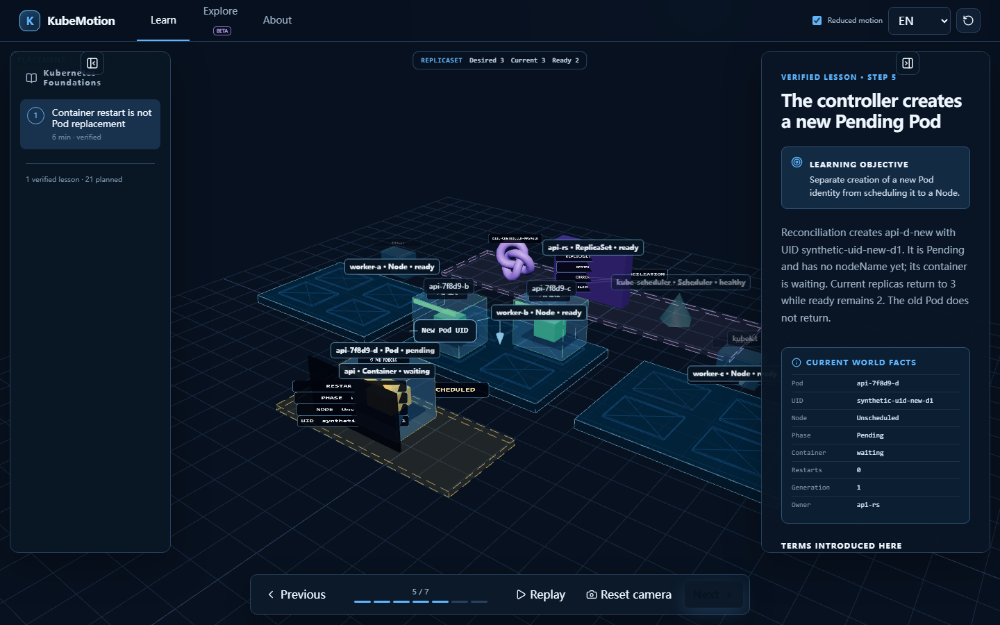

# KubeMotion

**事実の状態変化を見ながら Kubernetes を学ぶ。**

KubeMotion はオープンソースで静的配信を優先するインタラクティブ 3D 学習システムです。再構築版では、学習世界の事実を保持する `WorldSnapshot` と、カメラ・強調・ラベル・説明アニメーションを担う `ViewProjection` を分離しました。これにより、Container の再起動を Pod の置換として描くことはありません。



## ライブデモ

[GitHub Pages の公式エントリ](https://tangbudu.github.io/kubemotion-3d/)

## 検証済みの範囲

- 完全に検証されたレッスンは `container-restart-vs-pod-replacement` の 1 本
- 事実に基づく決定的な 7 ステップ
- 21 本は計画中で、ロードマップ表示のみ
- Explore は Beta。一致項目だけでなく一ホップの所有・配置コンテキストも残す
- すべて合成データ。実クラスター、認証情報、telemetry、backend、resource mutation は扱わない

Node rack と Pod slot、子 Container を含む Pod shell、UID・Node 配置・restart count・instance generation、ReplicaSet の desired/current/ready、型付き relation、anchored callout を表示します。

## ローカル実行と検証

Node.js 24 と pnpm 11.16 が必要です。

```sh
pnpm install --frozen-lockfile
pnpm dev

pnpm format:check
pnpm lint
pnpm typecheck
pnpm content:validate
pnpm test:unit -- --run
pnpm build
pnpm test:e2e
```

E2E は desktop/mobile、全 7 ステップの screenshot、言語の永続化、20 サイクルの navigation/replay/selection/camera reset 後の renderer resource 安定性を検証します。ライセンスは MIT です。
