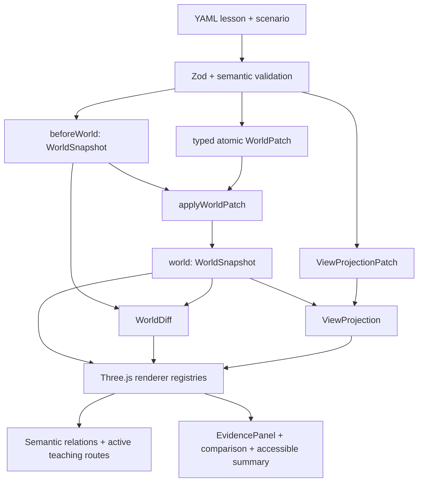

# KubeMotion

**事実の状態変化を観察しながら Kubernetes を学ぶ。**

KubeMotion は、オープンソースで静的配信を優先する 3D 学習システムです。world-state engine は、レッスン内の Kubernetes の事実を、それを説明するカメラ、強調、ラベル、ルート、アニメーションから分離します。この境界により、同一 Pod 内での Container 再起動と Pod の置換を、視覚的にもテスト上も明確に区別できます。


## ライブデモ

[GitHub Pages の公式デプロイを開く](https://tangbudu.github.io/kubemotion-3d/)

## 検証済みリリース範囲

- **完全に検証済みのレッスンは12本:** `why-kubernetes-exists` から `probes-and-rolling-update` まで、クラスター構造、Pod・Container、Namespace と Node、Deployment 所有関係、manifest、Pending、再起動と置換、label・selector、Service・EndpointSlice、DNS を含みます
- **Manifest 順序:** `why-kubernetes-exists` → `cluster-overview` → `pod-and-container` → `pod-and-placement` → `deployment-replicaset-and-pods` → `manifest-to-running-pod` → `pending-and-scheduling` → `container-restart-vs-pod-replacement` → `labels-and-selectors` → `service-routes-to-pods` → `dns-and-service-discovery` → `probes-and-rolling-update`
- **基礎から積み上げる順序:** 望ましい状態 → クラスター基盤 → Pod・Container → 論理スコープと配置 → workload 所有関係 → API・scheduling → self-healing → 選択 → Service traffic → DNS → probe・rolling update
- **Pod ライフサイクルは10ステップ:** オリエンテーション → 正常状態 → Container 終了 → 同一 Pod 内でのローカル再起動 → 意図的な Pod 削除 → Controller による置換 → 未スケジュールの Pending → Scheduler による binding → kubelet による起動と Ready 復帰 → snapshot 由来の比較
- **Service トラフィックは6ステップ:** オブジェクト確認 → 安定した Service 入口 → EndpointSlice の Ready 状態 → Ready backend へ到達する Request A → readiness の変化 → 別の Ready backend を選ぶ後続の Request B
- **計画中のレッスンは10本:** ロードマップ項目として表示しますが、完成済みとしては扱いません
- **Explore（Beta）:** コンパイル済み snapshot を絞り込みながら、1 hop の所有関係と配置コンテキストを保持します
- **合成データのみ:** 実クラスター、認証情報、telemetry、backend API、resource mutation は扱いません

Pod ライフサイクルレッスンでは、3 つの意味領域、API を介する制御ルート、実際の未スケジュール用トレイ、kubelet と Pod bay を備えた Node rack、子 Container を含む Pod shell を表示します。Container status slot は `containerID`、`restartCount`、`state`、`lastState` を示し、ReplicaSet は `SPEC / OBSERVED / READY` を表示します。Pod phase と Pod conditions は別々の事実として扱います。

Service トラフィックレッスンでは、安定した Service アドレス、EndpointSlice の API 状態、選択された Ready backend を分離します。完了済みの Request A と後続の Request B は別のリクエストです。12 本すべてが Evidence と takeaway を備えた固定 teaching panel、衝突を避けるラベル、明示的な replay、意味を失わない reduced-motion fallback を使い、ルートを持つ因果・通信ステップでは太い teaching route を永続表示します。

## アーキテクチャ



アーキテクチャの境界は次のとおりです。

- `WorldSnapshot = factual state`: Kubernetes の事実に関する唯一の source of truth です。
- `ViewProjection = presentation only`: 事実を隠す、弱める、ラベル付けする、画面内に収めることはできますが、事実そのものは上書きできません。
- `active teaching routes = explanation over settled facts`: 確定した状態の上に、責任と因果関係の説明を重ねます。
- `animations are not packet captures`: アニメーションは確定状態間のキャンセル可能な説明であり、実際の packet capture や厳密な timing trace ではありません。
- `Service data plane is implementation-dependent`: 表示する経路は説明用モデルであり、特定実装を保証しません。

各 `CompiledStep` は `beforeWorld`、`world`、`worldDiff`、`view`、`transition` を持ちます。React は route と serializable な UI state を所有し、`SceneController` は Three.js handle、relation resource、DOM label/callout、pool 済み animation token、post-processing、描画、破棄を所有します。詳細は[アーキテクチャノート](docs/architecture.md)を参照してください。

## クイックスタート

必要環境は Node.js 24 と pnpm 11.16 です。

```sh
pnpm install --frozen-lockfile
pnpm dev
```

## 検証

```sh
pnpm format:check
pnpm lint
pnpm typecheck
pnpm content:validate
pnpm content:accuracy
pnpm test:unit -- --run
pnpm build
pnpm test:e2e
pnpm visual:capture
```

検証 suite は、型付き patch transaction、決定的な diff、snapshot の不変性、cue contract、専用 visual、view 別レイアウト、12 本の事実 timeline、desktop/mobile の navigation と言語永続化、camera/route/label gate、1440×900・1280×720・390×844 の必須 visual capture、完全に検証済みの 12 レッスンを対象とする 20 cycle の renderer memory stress を含みます。人手による screenshot acceptance も必須です。[review checklist](docs/review/VISUAL_ACCEPTANCE_CHECKLIST.md)と[before/after evidence](docs/review/BEFORE_AFTER.md)を参照してください。

## デプロイ

Hash routing と相対 Vite base により、GitHub Pages を公式の静的 host としています。repository には digest pin 済みの non-root nginx image と hardened Helm chart も含まれますが、どちらも Kubernetes RBAC を必要としません。

## 正確性と安全性

レッスンの主張は Kubernetes 公式ドキュメントを引用し、検証日を保持します。アニメーションは責任と因果関係を説明するもので、packet capture や厳密な timing trace ではありません。合成 ID と timestamp は教材用データとして明示し、各 field の意味は Kubernetes API の概念に従います。renderer 専用の `WorldEntity.status` は Kubernetes の事実として Evidence に表示しません。Service data plane の動作は実装依存です。詳細は[正確性ポリシー](docs/accuracy-policy.md)と[visual semantics](docs/visualization-semantics.md)を参照してください。

## ライセンス

MIT
