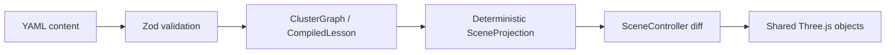

# KubeMotion

**Learn Kubernetes by watching it move.**

KubeMotion is an open-source, static-first, interactive 3D teaching system. It explains what Kubernetes objects are, which components manage them, where Pods run, how control loops converge, and how application traffic reaches changing backends.

<!-- Add a real release screenshot or GIF here after capturing the verified build. -->

## Live demo

[Open the deployed KubeMotion site](http://kubemotion.109-123-230-235.sslip.io/)

## What it teaches

Release 0.1 contains five complete lessons covering cluster architecture, the difference between Namespace and Node, the path from a Deployment manifest to a running Pod, Service and EndpointSlice behavior, and container restart versus Pod replacement. Learn and Explore modes share one synthetic `demo-shop` graph and five deterministic views: Overview, Logical, Placement, Control Flow, and Traffic.

## What it deliberately does not do

KubeMotion does not connect to a real cluster, accept cluster credentials, read telemetry, show logs, offer a terminal, or write Kubernetes resources. The animations are sourced conceptual explanations—not packet captures or literal timing traces.

## Architecture



React owns routes and serializable UI state. `SceneController` owns Three.js resources. Course steps compile to complete projections, so direct links, Back, language changes, and replay never depend on hidden scene history.

## Quick start

Requirements: Node.js 24 and pnpm.

```sh
pnpm install --frozen-lockfile
pnpm dev
```

## Content validation

`pnpm content:validate` parses YAML, validates Zod schemas, builds the graph, compiles all available lessons, checks references and selectors, verifies source hosts and prerequisite cycles, enforces glossary order, and scans for sensitive or known misleading expressions.

## Validation

```sh
pnpm format:check
pnpm lint
pnpm typecheck
pnpm content:validate
pnpm test:unit --run
pnpm build
pnpm test:e2e
```

## Deployment

The Vite output works on GitHub Pages through HashRouter. A digest-pinned, non-root nginx image and a hardened Helm chart are also included. The chart deploys only the static site and creates no ServiceAccount or RBAC.

## Accuracy policy

Core teaching facts cite Kubernetes or Gateway API official documentation and carry a verification date. Automated rules catch references, invalid flow paths, translation omissions, and a limited denylist; human review is still required for semantic accuracy. See `docs/accuracy-policy.md`.

## Roadmap

Seventeen later lessons are listed as non-interactive roadmap entries. Live monitoring, authentication, team features, a backend, and cluster mutation are intentionally outside Release 0.1.

## License

MIT
