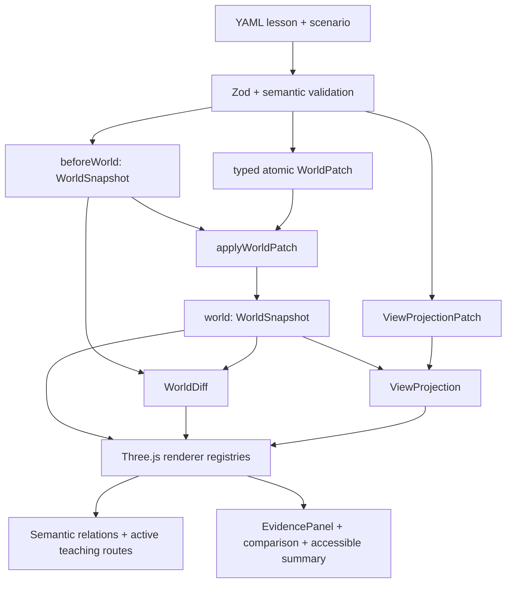

# KubeMotion

**Learn Kubernetes by watching factual state change.**

KubeMotion is an open-source, static-first 3D teaching system. Its world-state engine separates
the Kubernetes facts in a lesson from the camera, emphasis, labels, routes, and animation used to
explain them. That boundary makes a Container restart visibly and testably different from replacing
a Pod.


## Live demo

[Open the canonical GitHub Pages deployment](https://tangbudu.github.io/kubemotion-3d/)

## Verified release scope

- **2 fully verified lessons:** `container-restart-vs-pod-replacement` and `service-routes-to-pods`
- **10-step Pod lifecycle:** orientation → healthy baseline → Container exit → in-place restart → intentional Pod deletion → controller replacement → unscheduled Pending → scheduler binding → kubelet start/readiness → snapshot-derived comparison
- **6-step Service traffic path:** identify objects → stable Service entry → EndpointSlice readiness → request to a Ready backend → NotReady reroute → summary
- **20 planned lessons:** visible as roadmap entries, not represented as complete
- **Explore (Beta):** filters a compiled snapshot while keeping one-hop ownership and placement context
- **Synthetic only:** no cluster credentials, telemetry, backend, or resource mutation

The Pod lifecycle lesson shows three semantic zones, API-mediated control routes, a real
unscheduled tray, Node racks with embedded kubelets and Pod bays, Pods as shells containing child
Containers, and in-place ReplicaSet counters. The traffic lesson separates the stable Service
address, EndpointSlice API state, and the selected Ready backend. Both use fixed EvidencePanels,
collision-aware labels, persistent wide teaching routes, explicit replay, and reduced-motion
fallbacks.

## Architecture



`WorldSnapshot` is the factual source of truth. `ViewProjection` can hide, dim, label, or frame
facts, but it cannot override them. Every `CompiledStep` includes `beforeWorld`, `world`,
`worldDiff`, `view`, and `transition`. Animations are cancellable explanations between settled
states and never become factual state.

React owns routes and serializable UI state. `SceneController` owns Three.js handles, relation
resources, DOM labels/callouts, pooled animation tokens, post-processing, rendering, and disposal.
See [the architecture notes](docs/architecture.md).

## Quick start

Requirements: Node.js 24 and pnpm 11.16.

```sh
pnpm install --frozen-lockfile
pnpm dev
```

## Validation

```sh
pnpm format:check
pnpm lint
pnpm typecheck
pnpm content:validate
pnpm test:unit -- --run
pnpm build
pnpm test:e2e
pnpm visual:capture
```

The suite covers typed patch transactions, deterministic diffs, snapshot immutability, cue
contracts, specialized visuals, stable and traffic-specific layouts, both factual timelines,
desktop/mobile navigation and language persistence, camera/route/label gates, required visual
captures at 1440×900, 1280×720, and 390×844, and 20-cycle renderer memory stress across both
verified lessons. Human screenshot acceptance remains mandatory; see the
[review checklist](docs/review/VISUAL_ACCEPTANCE_CHECKLIST.md) and
[before/after evidence](docs/review/BEFORE_AFTER.md).

## Deployment

Hash routing and a relative Vite base make GitHub Pages the canonical static host. The repository
also includes a digest-pinned, non-root nginx image and hardened Helm chart; neither requires
Kubernetes RBAC.

## Accuracy and safety

Lesson claims cite official Kubernetes documentation and carry a verification date. Animations
explain responsibility and causality; they are not packet captures or literal timing traces. See
[the accuracy policy](docs/accuracy-policy.md) and
[visual semantics](docs/visualization-semantics.md).

## License

MIT
