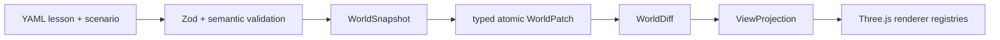

# KubeMotion

**Learn Kubernetes by watching factual state change.**

KubeMotion is an open-source, static-first 3D teaching system. Its rebuild separates the Kubernetes facts in a lesson from the camera, emphasis, labels, and animation used to explain them. That boundary makes a Container restart visibly and testably different from replacing a Pod.


## Live demo

[Open the canonical GitHub Pages deployment](https://tangbudu.github.io/kubemotion-3d/)

## Verified release scope

- **1 fully verified lesson:** `container-restart-vs-pod-replacement`
- **7 deterministic factual steps:** healthy Pod → Container exit → in-place Container restart → old Pod deletion → new Pending Pod → scheduling to `worker-c` → snapshot-derived comparison
- **21 planned lessons:** visible as roadmap entries, not represented as complete
- **Explore (Beta):** filters a compiled snapshot while keeping one-hop ownership and placement context
- **Synthetic only:** no cluster credentials, telemetry, backend, or resource mutation

The golden lesson shows Node racks with Pod slots, Pods as shells containing child Containers, Pod UID and Node placement, Container restart count and generation, ReplicaSet desired/current/ready counters, typed relations, anchored callouts, and explicit replay.

## Architecture



`WorldSnapshot` is the factual source of truth. `ViewProjection` can hide, dim, label, or frame facts, but it cannot override them. Every `CompiledStep` includes `beforeWorld`, `world`, `worldDiff`, `view`, and `transition`. Animations are cancellable explanations between settled states and never become factual state.

React owns routes and serializable UI state. `SceneController` owns Three.js handles, relation resources, DOM labels/callouts, pooled animation tokens, rendering, and disposal. See [the architecture notes](docs/architecture.md).

## Quick start

Requirements: Node.js 24 and pnpm 11.16.

```sh
pnpm install --frozen-lockfile
pnpm dev
```

## Validation

```sh
pnpm format:check
pnpm lint
pnpm typecheck
pnpm content:validate
pnpm test:unit -- --run
pnpm build
pnpm test:e2e
```

The suite covers typed patch transactions, deterministic diffs, snapshot immutability, all 14 cue handlers, specialized visuals, stable layout, the seven-step factual timeline, seven desktop visual baselines, a mobile visual baseline, desktop/mobile navigation and language persistence, and 20-cycle renderer memory stress.

## Deployment

Hash routing and a relative Vite base make GitHub Pages the canonical static host. The repository also includes a digest-pinned, non-root nginx image and hardened Helm chart; neither requires Kubernetes RBAC.

## Accuracy and safety

Lesson claims cite official Kubernetes documentation and carry a verification date. Animations explain responsibility and causality; they are not packet captures or literal timing traces. See [the accuracy policy](docs/accuracy-policy.md) and [visual semantics](docs/visualization-semantics.md).

## License

MIT
