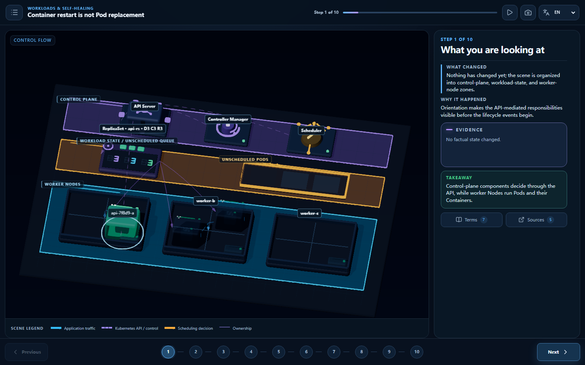
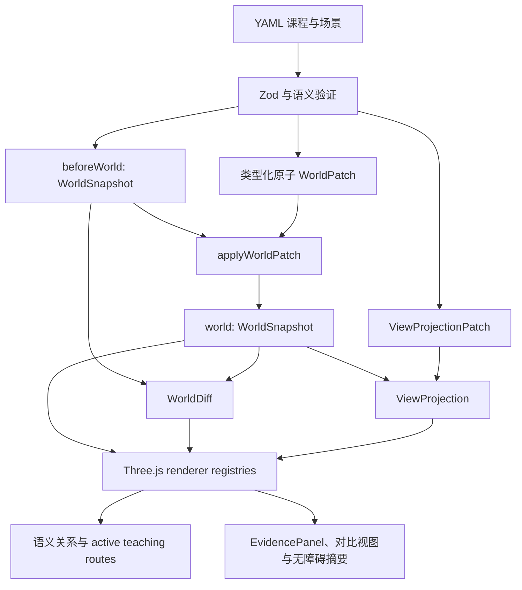

# KubeMotion

**通过观察事实状态变化来学习 Kubernetes。**

KubeMotion 是一个开源、静态优先的 3D 教学系统。它的世界状态引擎把课程中的
Kubernetes 事实，与用于讲解这些事实的镜头、强调、标签、路线和动画分离。因此，
同一 Pod 内的容器重启与 Pod 替换不仅看起来不同，也能通过测试明确区分。



## 在线演示

[打开官方 GitHub Pages 部署](https://tangbudu.github.io/kubemotion-3d/)

## 当前已验证范围

- **2 节完整验证课程：** `container-restart-vs-pod-replacement` 与 `service-routes-to-pods`
- **10 步 Pod 生命周期：** 场景导览 → 健康基线 → 容器进程退出 → kubelet 在同一 Pod 内本地重启运行时容器 → 主动删除 Pod → Controller 创建替换 Pod → 未调度 Pending → Scheduler 绑定 Node → kubelet 启动容器并恢复 Ready → 根据 snapshot 生成对比
- **6 步 Service 流量路径：** 识别对象 → 稳定 Service 入口 → EndpointSlice Ready 状态 → Request A 到达 Ready 后端 → Ready 状态变化 → 后续 Request B 选择另一个 Ready 后端
- **20 节规划中课程：** 只作为路线图显示，不视为已经完成
- **Explore（Beta）：** 筛选编译后的 snapshot，同时保留一跳所有权和放置上下文
- **仅使用合成数据：** 不连接真实集群，不接收凭据，不读取遥测，不提供后端 API，也不修改资源

Pod 生命周期课程将控制面、工作负载状态／未调度区和 Worker Node 分开。一个命名的
Container 子实体表示稳定的容器状态槽；同一 Pod 内重启时，新的运行时容器拥有新的
`containerID`，`restartCount` 增加，旧终止信息记录在 `lastState` 中。Pod phase 与
conditions 分开显示，ReplicaSet 使用 `SPEC / OBSERVED / READY`，同 Pod 重启的主要因果
路线是本地 kubelet → Container，而主动删除和替换才经过 API。

Service 流量课程区分稳定的 Service 地址、相邻的 EndpointSlice API 状态与实际选中的
Ready 后端。Request A 完成后，api-a 仍列在 EndpointSlice 中，但条件变为
`ready=false`、`serving=false`、`terminating=false`；之后发起的后续 Request B 通过同一
Service 选择另一个 Ready 后端，而不是迁移已经运行的请求。

## 架构



`WorldSnapshot` 是事实状态的唯一来源。`ViewProjection` 只负责展示，可以隐藏、弱化、
标注或取景，但不能覆盖事实。active teaching routes 是建立在已稳定事实之上的讲解层。
每个 `CompiledStep` 都包含 `beforeWorld`、`world`、`worldDiff`、`view` 和 `transition`。
动画只解释稳定 snapshot 之间的教学因果序列，不是网络抓包、控制器真实时序记录、保证
顺序的 trace，也不承诺某一种 Service 数据面实现；Service 数据面的具体行为取决于集群
实现。

React 管理路由和可序列化 UI 状态；`SceneController` 管理 Three.js handles、关系资源、
DOM 标签与 callout、复用的动画 token、后处理、渲染和资源释放。详见
[架构说明](docs/architecture.md)。

## 快速开始

环境要求：Node.js 24 与 pnpm 11.16。

```sh
pnpm install --frozen-lockfile
pnpm dev
```

## 验证

```sh
pnpm format:check
pnpm lint
pnpm typecheck
pnpm content:validate
pnpm content:accuracy
pnpm test:unit -- --run
pnpm build
pnpm test:e2e
pnpm visual:capture
```

测试覆盖类型化 patch transaction、确定性 diff、snapshot 不可变性、cue contract、专用
视觉对象、稳定布局与流量布局、两条事实时间线、桌面／移动导航、语言持久化，以及镜头、
路线和标签门禁。必需视觉截图覆盖 1440×900、1280×720 与 390×844；渲染资源还要通过两节
已验证课程的 20 轮压力检查。自动测试不能替代人工截图验收，结果见
[视觉验收清单](docs/review/VISUAL_ACCEPTANCE_CHECKLIST.md)和
[改造前后证据](docs/review/BEFORE_AFTER.md)。

## 部署

Hash routing 与相对 Vite base 使 GitHub Pages 成为官方静态托管入口。仓库还提供 digest
固定、非 root 的 nginx 镜像和加固后的 Helm chart；两者都不需要 Kubernetes RBAC。

## 准确性与安全

课程事实引用 Kubernetes 官方文档并记录验证日期。合成 ID 和时间戳明确属于教学数据，
字段含义遵循 Kubernetes API 概念。renderer-only 的 `WorldEntity.status` 只能控制颜色、
badge、轮廓或强调，不会作为 Kubernetes API 事实出现在 Evidence 中。详见
[准确性政策](docs/accuracy-policy.md)与[可视化语义](docs/visualization-semantics.md)。

## 许可证

MIT
