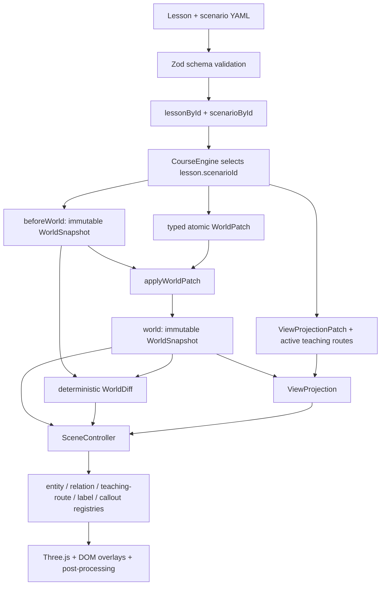

# Architecture

## Factual world state

`WorldSnapshot` is the only factual source of truth. Entities and relations use stable explicit IDs. A step changes the world through ordered, typed operations: add, remove, or patch an entity or relation. `applyWorldPatch` clones input, rejects missing/duplicate targets and identity changes, applies the transaction atomically, validates the resulting graph, deep-freezes it, and increments its revision.

`computeWorldDiff` compares two snapshots without mutation. Its added, removed, and updated records are deterministically sorted and include changed JSON-pointer-style paths.

The content loader parses both verified lessons and both v2 scenarios, rejects duplicate IDs, and
indexes them as `lessonById` and `scenarioById`. `LearnPage` resolves each lesson through its
`scenarioId`; the legacy `scenario` export remains only as the golden world alias used by Home and
Explore.

`CourseEngine` compiles every step from the selected scenario and authored patches. The verified
catalog currently contains a ten-step Pod lifecycle lesson and a six-step Service traffic lesson.
A `CompiledStep` contains:

- `beforeWorld`
- `world`
- `worldDiff`
- `evidence`
- `view`
- `transition`

Direct links and arbitrary jumps therefore compile to the same settled state without hidden scene history.

## Presentation state

`ViewProjection` controls visibility, emphasis, labels, inspector detail, camera preset, relation
emphasis, callouts, active teaching routes, and the comparison panel. It has no factual status
override. The comparison table is derived from compiled snapshots and diffs rather than duplicated
prose constants.

Settled semantic relations and active teaching routes are separate layers. An active route has an
explicit semantic, ordered hops, source/target entity IDs, semantic anchors, optional short hop
labels, and persistence/numbering policy. Control and scheduling lessons can expose API-mediated
causality, while the Service lesson uses a logical client → Service → selected Ready Pod data path;
EndpointSlice remains adjacent API state rather than a packet hop. Routed animation cues drive the
already-owned route instead of creating a second transient line.

Explore builds a context-preserving projection over a compiled snapshot: matches are focused; directly related ownership, composition, and placement context remains visible and dimmed.

## Renderer ownership

React owns routing, localization, collapsible panels, replay IDs, and serializable Zustand state. It stores no `Object3D`, DOM node, GPU resource, animation object, promise, or cancellation token.

`SceneController` owns:

- one `WebGLRenderer`, scene, camera, controls, and render scheduler;
- specialized entity handles and stable layout guides;
- relation handles with per-semantic styles and arrowheads;
- obstacle-aware persistent teaching routes with pooled arrowheads, flow tokens, and numbered markers;
- collision-aware DOM labels and step-bound callouts;
- the cancellable animation coordinator and pooled tokens;
- a color-correct post-processing pipeline and tracked renderer event listeners;
- all cleanup on replacement or unmount.

Lesson scenes disable generic fallback visuals. Node, Pod, client Pod, Container, ReplicaSet, API
Server, kubectl, kubelet, controller manager, scheduler, Service, and EndpointSlice each have a
dedicated factory and visual handle.

## Post-processing

The WebGL renderer disables its built-in antialiasing and renders through one owned
`PostProcessingPipeline`. The default chain is `RenderPass` → SMAA → `OutputPass`; the explicit
fallback is `RenderPass` → `OutputPass` → FXAA, preserving the color-space order expected by each
antialiasing pass. It intentionally has no global bloom or full-scene outline. The pipeline owns and
disposes its composer buffers and pass resources, restores
`renderer.info.autoReset`, and reports its render-target count, enabled pass count, and selected
antialiasing mode; `SceneDiagnostics` promotes the owned render-target count to the debug bridge.

## Animation contract

Playback is explicit: `{ stepKey, playbackId, transition }`. Duplicate or stale IDs do not replay.
Each supported cue kind is dispatched through a handler with `start`, `update`, `finish`, `cancel`,
and `dispose` behavior; the architecture does not depend on a fixed cue-count claim. Cancellation
restores captured transform, visibility, and material baselines. Reduced motion caps cue duration at
140 ms and avoids large movement while preserving settled route direction and factual end state.

Animations explain transitions between factual states. They do not modify `WorldSnapshot`.

## Resource regression signals

The debug bridge exposes `entityHandles`, aggregate `relationHandles`, `labels`, `callouts`,
`activeAnimations`, `pooledTokens`, and `retainedExitHandles`; `renderer.info`-backed `geometries`,
`textures`, `programs`, and `drawCalls`; route-owned `routeHandles`, `arrowheads`, `flowTokens`,
`routeMarkers`, `wideLineGeometries`, and `wideLineMaterials`; plus post-processing `renderTargets`
and tracked `eventListeners`.

The E2E resource gate first warms all ten Pod steps and all six Service steps. It then performs 20
cycles that alternate between the two lessons while mixing navigation, replay, locale changes,
selection, and camera reset. After returning to the same route-heavy Pod step and waiting for idle,
it requires animations and retained exits to be zero, stable handle/render-target/listener counts to
match, and renderer, pool, route-marker, arrowhead, and flow-token counts to stay within their stated
bounds.
