# Architecture

```mermaid
flowchart LR
  Authoring["YAML authoring"] --> Schema["Zod schema validation"]
  Schema --> Snapshot["immutable WorldSnapshot"]
  Snapshot --> Patch["typed atomic WorldPatch"]
  Patch --> Diff["deterministic WorldDiff"]
  Diff --> View["ViewProjection"]
  View --> Scene["SceneController"]
  Scene --> Registries["entity / relation / label / callout registries"]
  Registries --> Three["Three.js + DOM overlays"]
```

## Factual world state

`WorldSnapshot` is the only factual source of truth. Entities and relations use stable explicit IDs. A step changes the world through ordered, typed operations: add, remove, or patch an entity or relation. `applyWorldPatch` clones input, rejects missing/duplicate targets and identity changes, applies the transaction atomically, validates the resulting graph, deep-freezes it, and increments its revision.

`computeWorldDiff` compares two snapshots without mutation. Its added, removed, and updated records are deterministically sorted and include changed JSON-pointer-style paths.

`CourseEngine` compiles every step from the scenario and authored patches. A `CompiledStep` contains:

- `beforeWorld`
- `world`
- `worldDiff`
- `view`
- `transition`

Direct links and arbitrary jumps therefore compile to the same settled state without hidden scene history.

## Presentation state

`ViewProjection` controls visibility, emphasis, labels, inspector detail, camera preset, relation emphasis, callouts, and the comparison panel. It has no factual status override. The comparison table is derived from compiled snapshots and diffs rather than duplicated prose constants.

Explore builds a context-preserving projection over a compiled snapshot: matches are focused; directly related ownership, composition, and placement context remains visible and dimmed.

## Renderer ownership

React owns routing, localization, collapsible panels, replay IDs, and serializable Zustand state. It stores no `Object3D`, DOM node, GPU resource, animation object, promise, or cancellation token.

`SceneController` owns:

- one `WebGLRenderer`, scene, camera, controls, and render scheduler;
- specialized entity handles and stable layout guides;
- relation handles with per-semantic styles and arrowheads;
- collision-aware DOM labels and step-bound callouts;
- the cancellable animation coordinator and pooled tokens;
- all cleanup on replacement or unmount.

The golden lesson disables generic fallback visuals. Node, Pod, Container, ReplicaSet, kubelet, controller manager, and scheduler each have a dedicated factory and visual handle.

## Animation contract

Playback is explicit: `{ stepKey, playbackId, transition }`. Duplicate or stale IDs do not replay. Each of the 14 cue types has a dedicated handler with `start`, `update`, `finish`, `cancel`, and `dispose` behavior. Cancellation restores captured transform, visibility, and material baselines. Reduced motion caps cue duration at 140 ms and avoids large movement.

Animations explain transitions between factual states. They do not modify `WorldSnapshot`.

## Resource regression signals

The debug bridge exposes entity/relation handle counts, DOM label/callout counts, active animations, pooled tokens, retained exit handles, and `renderer.info` geometry/texture/program/draw-call counts. The E2E stress gate warms all seven steps, performs 20 mixed navigation/replay/language/selection/camera-reset cycles, returns to the same step, and checks that these counts remain bounded.
