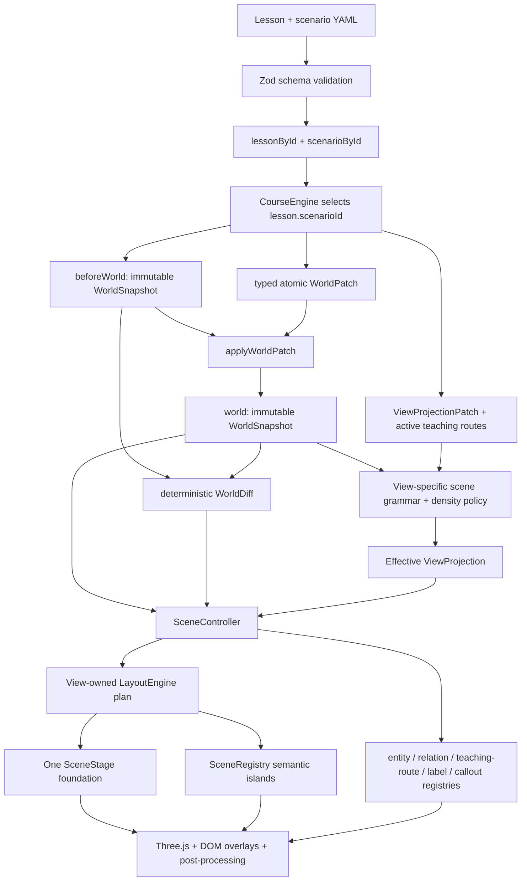

# Architecture

## Factual world state

`WorldSnapshot` is the only factual source of truth. Entities and relations use stable explicit IDs. A step changes the world through ordered, typed operations: add, remove, or patch an entity or relation. `applyWorldPatch` clones input, rejects missing/duplicate targets and identity changes, applies the transaction atomically, validates the resulting graph, deep-freezes it, and increments its revision.

Synthetic IDs and timestamps are teaching data, but their field meanings follow Kubernetes API
concepts. ReplicaSet counters map to `.spec.replicas`, `.status.replicas`, and
`.status.readyReplicas`. Pod phase is stored separately from `PodScheduled`, `Initialized`,
`ContainersReady`, and `Ready` conditions. A stable Container-status slot exposes `containerID`,
`state`, `lastState`, `ready`, `started`, and `restartCount`; it does not claim that one immutable
runtime process survives a restart.

`computeWorldDiff` compares two snapshots without mutation. Its added, removed, and updated records are deterministically sorted and include changed JSON-pointer-style paths.

The content loader parses both verified lessons and both v2 scenarios, rejects duplicate IDs, and
indexes them as `lessonById` and `scenarioById`. `LearnPage` resolves each lesson through its
`scenarioId`; the legacy `scenario` export remains only as the golden world alias used by Home and
Explore.

`CourseEngine` compiles every step from the selected scenario and authored patches. The verified
catalog currently contains a ten-step Pod lifecycle lesson and a six-step Service traffic lesson.
A `CompiledStep` contains:

- `beforeWorld`
- `world`
- `worldDiff`
- `evidence`
- `view`
- `transition`

Direct links and arbitrary jumps therefore compile to the same settled state without hidden scene history.

## Presentation state

`ViewProjection` controls visibility, emphasis, labels, inspector detail, camera preset, relation
emphasis, callouts, active teaching routes, and the comparison panel. Before rendering, the final
authored projection passes through one of six scene grammars. The grammar fails closed on unrelated
kinds, enforces per-view and per-kind density, preserves required route/focus context, closes the
physical hierarchy in Placement and Control Flow, and limits relation families. It has no factual
status override. See [Scene grammars](./scene-grammars.md).

The comparison table is derived from compiled snapshots and diffs rather than duplicated prose
constants. Its six rows cover Pod name, Pod UID, Node, Container ID, Container restart count, and
Pod object; it deliberately makes no storage-persistence claim.

`WorldEntity.status` is a renderer-facing summary used for color, silhouette, and status badges. It
remains available to rendering code, but it is never promoted to learner-facing Evidence,
comparison rows, or accessible factual summaries. Kubernetes facts come from the kind-specific
`data` fields: Pod phase and conditions, ContainerStatus fields, ReplicaSet counters, and the
Service or EndpointSlice data model.

Settled semantic relations and active teaching routes are separate layers. An active route has an
explicit semantic, ordered hops, source/target entity IDs, semantic anchors, optional short hop
labels, and persistence/numbering policy. Control and scheduling lessons can expose API-mediated
causality, while the Service lesson uses a logical client → Service → selected Ready Pod data path;
EndpointSlice remains adjacent API state rather than a packet hop. A separate `node-runtime`
semantic shows same-Node kubelet work without making the API Server the per-crash initiator. Routed
animation cues drive the already-owned route instead of creating a second transient line.

Control routes simplify watch/update interactions and are not packet captures. Service data-plane
behavior is implementation-dependent; distinct request IDs prevent a later request from looking
like migration of an in-flight request.

Explore now starts from the Overview grammar instead of an all-object projection. Explicit filters
focus their direct matches and retain bounded one-hop context; the focused override is Explore-only
and still passes through density and relation-endpoint gates.

Overview and Control Flow are independent scene grammars, not alternate camera positions over one
universal arrangement. Overview owns a deterministic foundation-first layout for cluster identity,
control-plane responsibility, worker placement, and the unscheduled/transit area; it does not
inherit Placement geometry. Control Flow owns a separate causal projection onto control-plane,
workload/transit, and worker-node island families. It may reuse the proven physical allocation of a
Node and its assigned Pods, but that reuse does not make its visible-object policy, semantic zones,
or composition identical to Placement or Overview.

The foundational Cluster entity is a compact teaching-boundary plaque. It marks which objects are
being discussed as one synthetic cluster, but it is not a second floor and does not assert that a
Namespace physically contains Nodes or that Nodes are nested under a Namespace. The basic etcd
model permits only the API Server → etcd data-store relation; controllers, schedulers, kubelets,
clients, and application traffic do not connect directly to etcd in this conceptual layer.

## Renderer ownership

React owns routing, localization, collapsible panels, replay IDs, and serializable Zustand state. It stores no `Object3D`, DOM node, GPU resource, animation object, promise, or cancellation token.

`SceneController` owns:

- one `WebGLRenderer`, scene, camera, controls, and render scheduler;
- one bounded `SceneStage` foundation used for framing, with no dominant global debug grid;
- specialized entity handles and stable layout guides;
- relation handles with per-semantic styles and arrowheads;
- obstacle-aware persistent teaching routes with pooled arrowheads, flow tokens, and numbered markers;
- collision-aware DOM labels and step-bound callouts;
- the cancellable animation coordinator and pooled tokens;
- a color-correct post-processing pipeline and tracked renderer event listeners;
- all cleanup on replacement or unmount.

Foundation ownership is intentionally split by responsibility without duplicating geometry:

- `SceneStage` owns exactly one bounded base, its inset top/edge treatment, and a small set of local
  alignment marks. It does not own semantic islands.
- the selected layout computes the current view's island bounds, slots, and labels;
- `SceneRegistry` materializes and diffs those view-specific island plates and the unscheduled tray;
- the Cluster visual contributes only its compact boundary marker and never another floor slab.

Diagnostics expose foundation mesh count, semantic-island count, local alignment marks, and
dominant-grid marks so duplicate foundations or a returning full-stage grid are test failures rather
than subjective review findings.

Lesson scenes disable generic fallback visuals. Node, Pod, client Pod, Container, ReplicaSet, API
Server, etcd, Cluster boundary, kubectl, kubelet, controller manager, scheduler, Service, and
EndpointSlice each have a dedicated factory and visual handle.

## Post-processing

The WebGL renderer disables its built-in antialiasing and renders through one owned
`PostProcessingPipeline`. The default chain is `RenderPass` → SMAA → `OutputPass`; the explicit
fallback is `RenderPass` → `OutputPass` → FXAA, preserving the color-space order expected by each
antialiasing pass. It intentionally has no global bloom or full-scene outline. The pipeline owns and
disposes its composer buffers and pass resources, restores
`renderer.info.autoReset`, and reports its render-target count, enabled pass count, and selected
antialiasing mode; `SceneDiagnostics` promotes the owned render-target count to the debug bridge.

## Animation contract

Playback is explicit: `{ stepKey, playbackId, transition }`. Duplicate or stale IDs do not replay.
Each supported cue kind is dispatched through a handler with `start`, `update`, `finish`, `cancel`,
and `dispose` behavior; the architecture does not depend on a fixed cue-count claim. Cancellation
restores captured transform, visibility, and material baselines. Reduced motion caps cue duration at
140 ms and avoids large movement while preserving settled route direction and factual end state.

Animations explain transitions between factual states. They do not modify `WorldSnapshot`.

## Resource regression signals

The debug bridge exposes `entityHandles`, aggregate `relationHandles`, `labels`, `callouts`,
`activeAnimations`, `pooledTokens`, and `retainedExitHandles`; `renderer.info`-backed `geometries`,
`textures`, `programs`, and `drawCalls`; route-owned `routeHandles`, `arrowheads`, `flowTokens`,
`routeMarkers`, `wideLineGeometries`, and `wideLineMaterials`; plus post-processing `renderTargets`
and tracked `eventListeners`.

The E2E resource gate first warms all ten Pod steps and all six Service steps. It then performs 20
cycles that alternate between the two lessons while mixing navigation, replay, locale changes,
selection, and camera reset. After returning to the same route-heavy Pod step and waiting for idle,
it requires animations and retained exits to be zero, stable handle/render-target/listener counts to
match, and renderer, pool, route-marker, arrowhead, and flow-token counts to stay within their stated
bounds.
