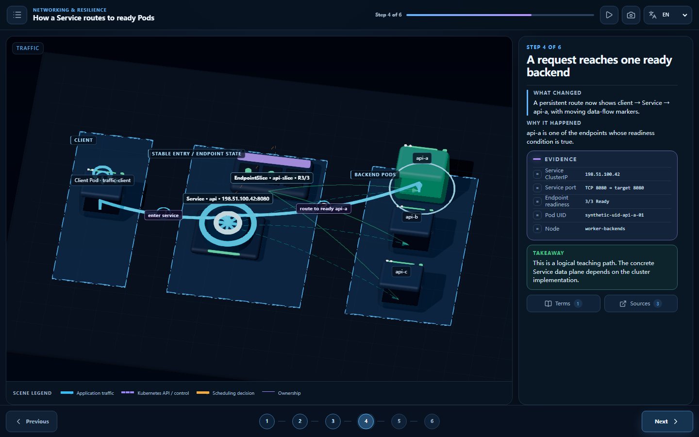

# Visual rebuild: before and after

This page compares the audited prototype with the rebuilt teaching system. The old images are
retained as evidence of the starting point, not as visual baselines.

## Before: scene state was difficult to read

| Prototype evidence                                                                     | What the audit found                                                                                                                              |
| -------------------------------------------------------------------------------------- | ------------------------------------------------------------------------------------------------------------------------------------------------- |
|          | The Node → Pod → Container hierarchy was not visible, the future replacement leaked into the opening state, and metadata competed with the scene. |
|  | Container failure could not be distinguished from Pod failure by shape and containment.                                                           |
|      | Placement appeared without a legible API-mediated controller, scheduler, and kubelet story.                                                       |

## After: facts, teaching projection, and causal route are separate

| Rebuilt evidence                                                         | What a learner can identify                                                                                                                                        |
| ------------------------------------------------------------------------ | ------------------------------------------------------------------------------------------------------------------------------------------------------------------ |
|   | Three stable teaching zones, distinct control-plane components, Worker Nodes, the focus Pod, and its contained Container.                                          |
|  | The kubelet route, unchanged Pod shell, reconstructed Container, stable Pod UID/Node evidence, and updated runtime counters.                                       |
|           | The settled API-mediated binding route, the replacement Pod placed on worker-c, and its phase still Pending; Container startup and readiness remain the next step. |
|      | A thick persistent client → Service → selected Ready Pod data path, with EndpointSlice shown as API state rather than a packet hop.                                |

## Structural changes

| Area            | Audited prototype                    | Rebuilt system                                                                                                                |
| --------------- | ------------------------------------ | ----------------------------------------------------------------------------------------------------------------------------- |
| Truth model     | Presentation state could imply facts | Immutable `WorldSnapshot` + typed patch + deterministic diff                                                                  |
| Entity language | Mostly generic primitives            | Dedicated Node, Pod, Container, API Server, controller, scheduler, ReplicaSet, Service, EndpointSlice, and client silhouettes |
| Relations       | Faint or ambiguous lines             | Stable semantic relations plus separate persistent `Line2` teaching routes                                                    |
| Lesson story    | Seven compressed steps               | Ten-step Pod lifecycle and six-step Service traffic lessons                                                                   |
| Evidence        | Floating metadata and prose          | Fixed `WorldDiff` EvidencePanel and snapshot-derived comparison                                                               |
| Composition     | Generic scene dump                   | Lesson-specific semantic zones, orthographic framing, collision-aware labels, and mobile teaching sheet                       |

The corresponding per-image review record is in
[`VISUAL_ACCEPTANCE_CHECKLIST.md`](./VISUAL_ACCEPTANCE_CHECKLIST.md).
