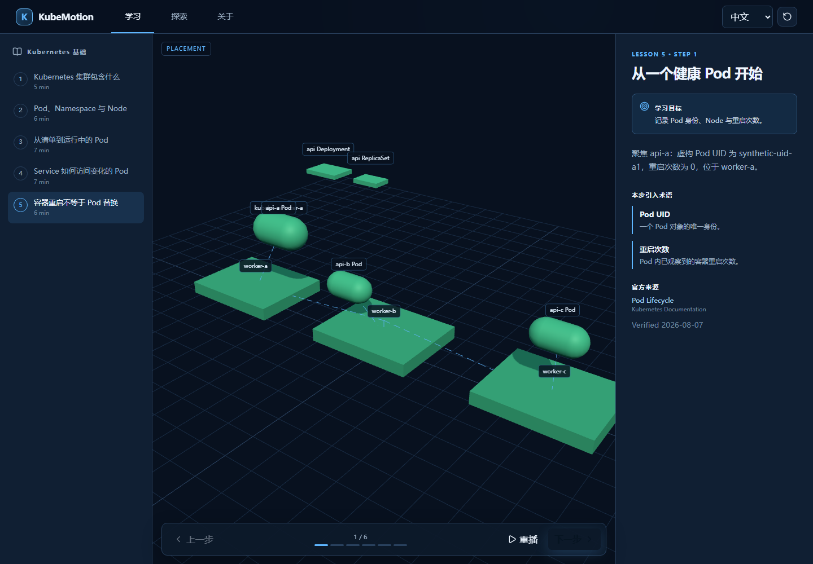
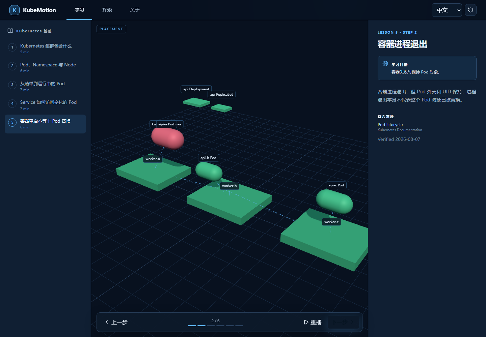
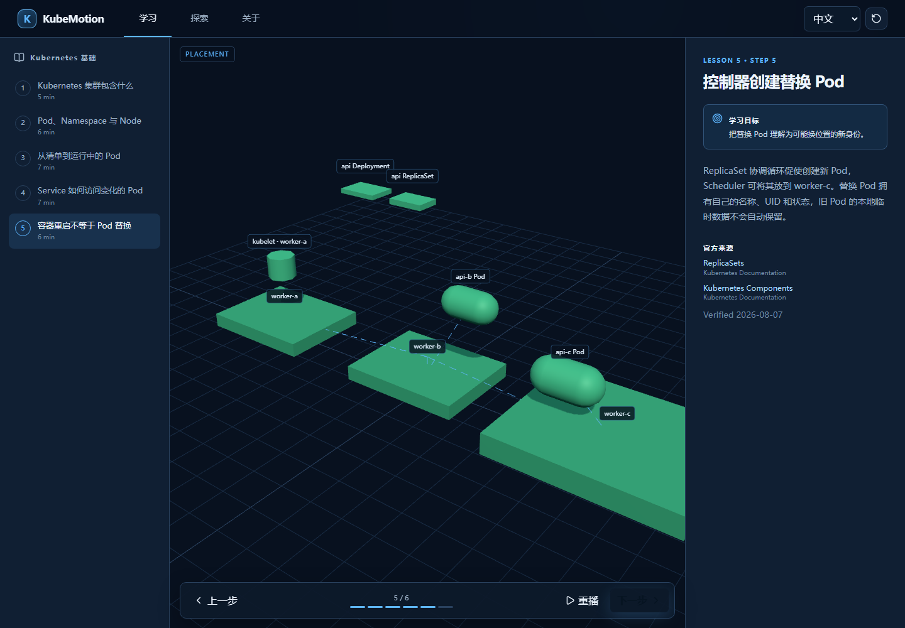
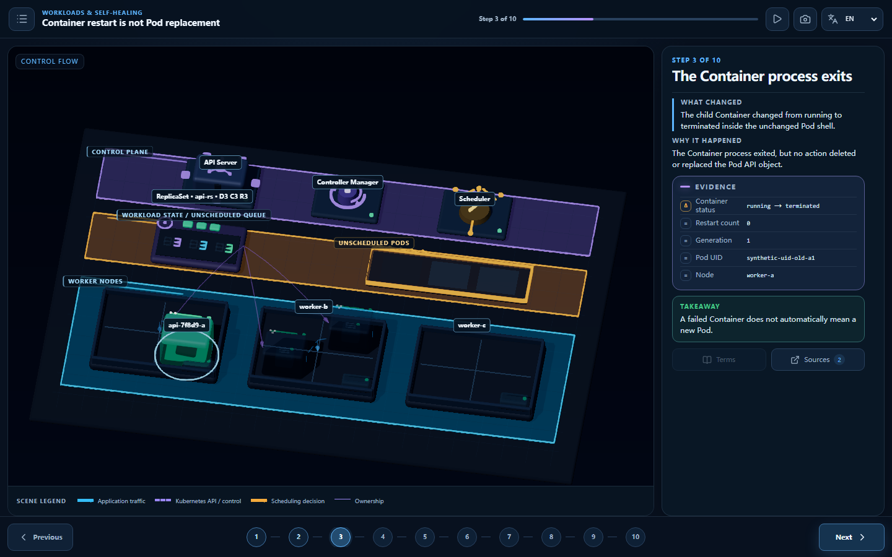
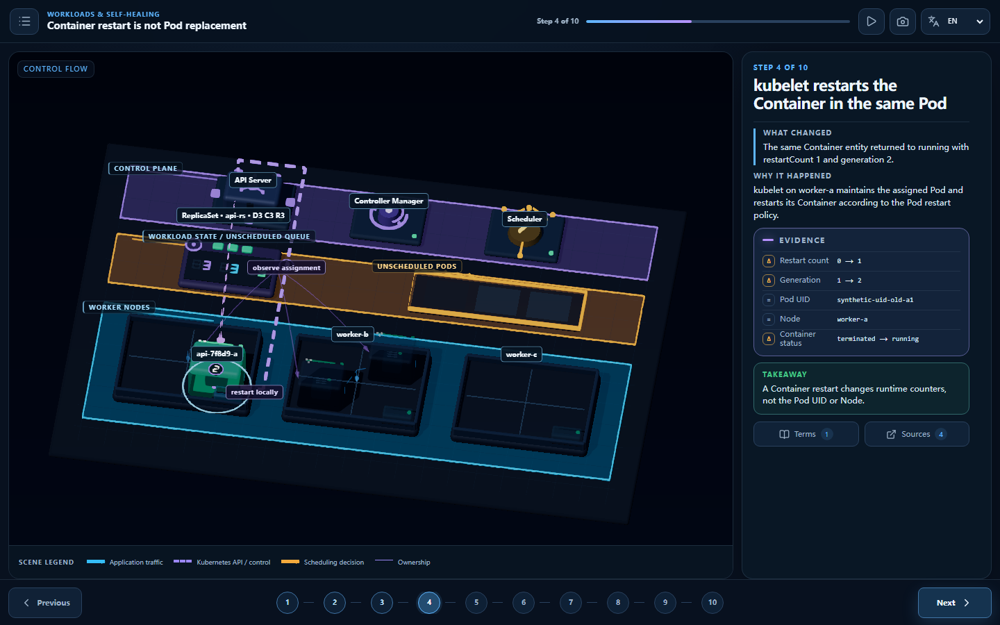
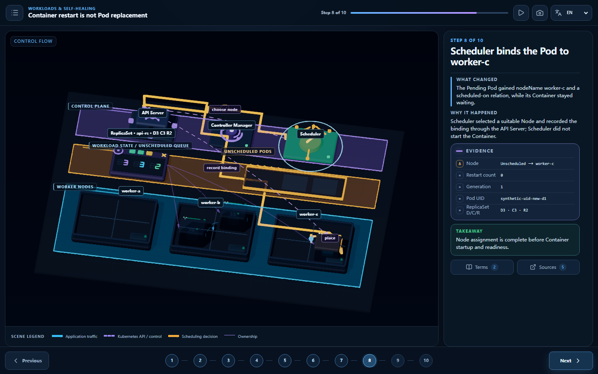
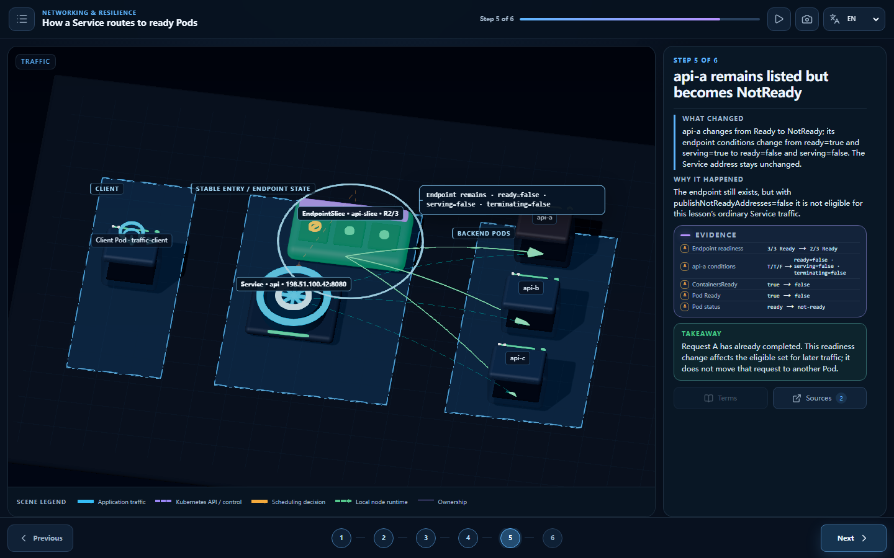
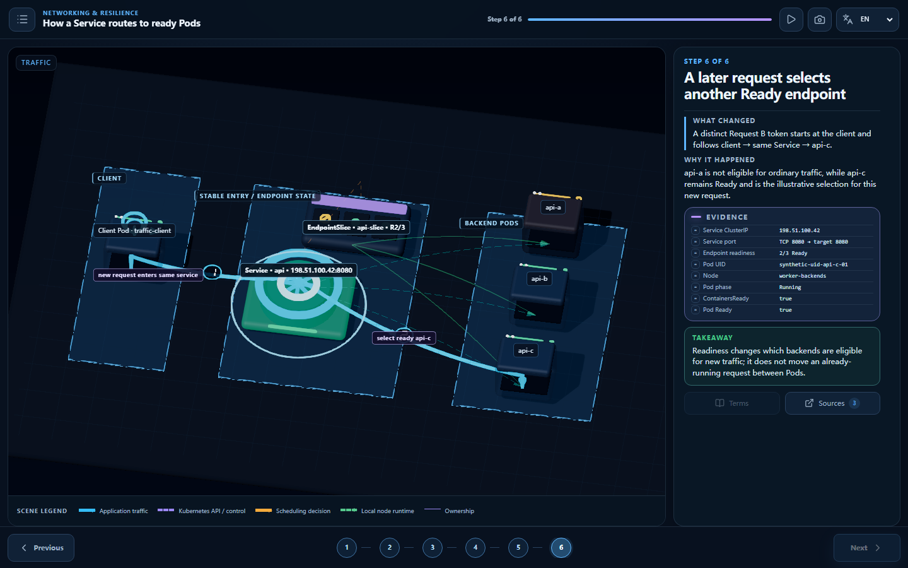

# Visual rebuild: before and after

This page compares the audited prototype with the corrected teaching system. The prototype images
are retained as evidence of the starting point, not as visual baselines.

## Before: scene state was difficult to read

| Prototype evidence                                                                     | Audit finding                                                                                                                                        |
| -------------------------------------------------------------------------------------- | ---------------------------------------------------------------------------------------------------------------------------------------------------- |
|          | The Node → Pod → Container hierarchy was unclear, a future replacement leaked into the opening state, and floating metadata competed with the scene. |
|  | Container failure could not be distinguished from Pod replacement or Pod readiness by shape and containment.                                         |
|      | Placement appeared without a legible separation between controller action, scheduling, and kubelet startup.                                          |

## After: facts, projection, and causal routes are separate

| Corrected evidence                                                                                 | What a learner can identify                                                                                                                                                                                              |
| -------------------------------------------------------------------------------------------------- | ------------------------------------------------------------------------------------------------------------------------------------------------------------------------------------------------------------------------ |
|      | The Container has terminated inside the intact Pod. Pod phase stays `Running`; `ContainersReady` and `Ready` become false; ReplicaSet `READY` drops from 3 to 2 while `OBSERVED` stays 3.                                |
|                      | The worker-a kubelet starts a replacement runtime Container locally. Pod UID and Node stay the same; `containerID` changes, `restartCount` increases, `lastState` records the exit, and ReplicaSet `READY` returns to 3. |
|              | The replacement Pod is bound to worker-c but remains `Pending` and NotReady. Scheduling and kubelet startup are separate settled states.                                                                                 |
|  | api-a remains in the EndpointSlice with `ready=false`, `serving=false`, and `terminating=false`; Request A is already complete and no ordinary route targets api-a.                                                      |
|               | Request B begins at the client, enters the unchanged Service, and selects Ready backend api-c. This is a new request, not migration of Request A.                                                                        |

## Structural and factual changes

| Area                  | Audited prototype                                                      | Corrected system                                                                                                                        |
| --------------------- | ---------------------------------------------------------------------- | --------------------------------------------------------------------------------------------------------------------------------------- |
| Truth model           | Presentation state could imply facts.                                  | Immutable `WorldSnapshot`, typed patch, deterministic diff, and a presentation-only `ViewProjection`.                                   |
| ReplicaSet            | API-like generic counter labels obscured the real fields.              | Explicit `.spec.replicas`, `.status.replicas`, and `.status.readyReplicas`, rendered as `SPEC / OBSERVED / READY`.                      |
| Container restart     | A synthetic generation implied the same runtime instance returned.     | A stable named Container-status slot exposes `containerID`, `state`, `lastState`, `ready`, `started`, and `restartCount`.               |
| Pod lifecycle         | Container exit did not propagate to Pod and ReplicaSet readiness.      | Pod phase and conditions are separate; a terminated only Container makes the Pod NotReady and reduces `readyReplicas`.                  |
| Local causality       | A control-plane route appeared to initiate a same-Pod restart.         | A dedicated green `node-runtime` route stays inside worker-a from kubelet to Container; API relations remain dim context.               |
| Replacement lifecycle | Creation, scheduling, and startup appeared compressed.                 | Deletion, controller creation, Pending/unscheduled identity, scheduler binding, and kubelet startup are distinct compiled steps.        |
| Service readiness     | Endpoint condition semantics and traffic timing were ambiguous.        | `publishNotReadyAddresses=false` is explicit; the NotReady endpoint remains listed with a consistent false/false/false condition tuple. |
| Request identity      | Visible wording could imply an in-flight request moved to another Pod. | Request A completes before readiness changes; a distinct Request B later selects api-c through the same Service.                        |
| Evidence              | Floating metadata and prose were the primary proof.                    | A fixed diff-derived EvidencePanel and snapshot-derived comparison expose the relevant API facts.                                       |
| Composition           | Generic scene dump.                                                    | Lesson-specific semantic zones, orthographic framing, collision-aware labels, focused factual crops, and a mobile teaching sheet.       |

The final 43-image review record and mandatory factual checks are documented in
[`VISUAL_ACCEPTANCE_CHECKLIST.md`](./VISUAL_ACCEPTANCE_CHECKLIST.md).
